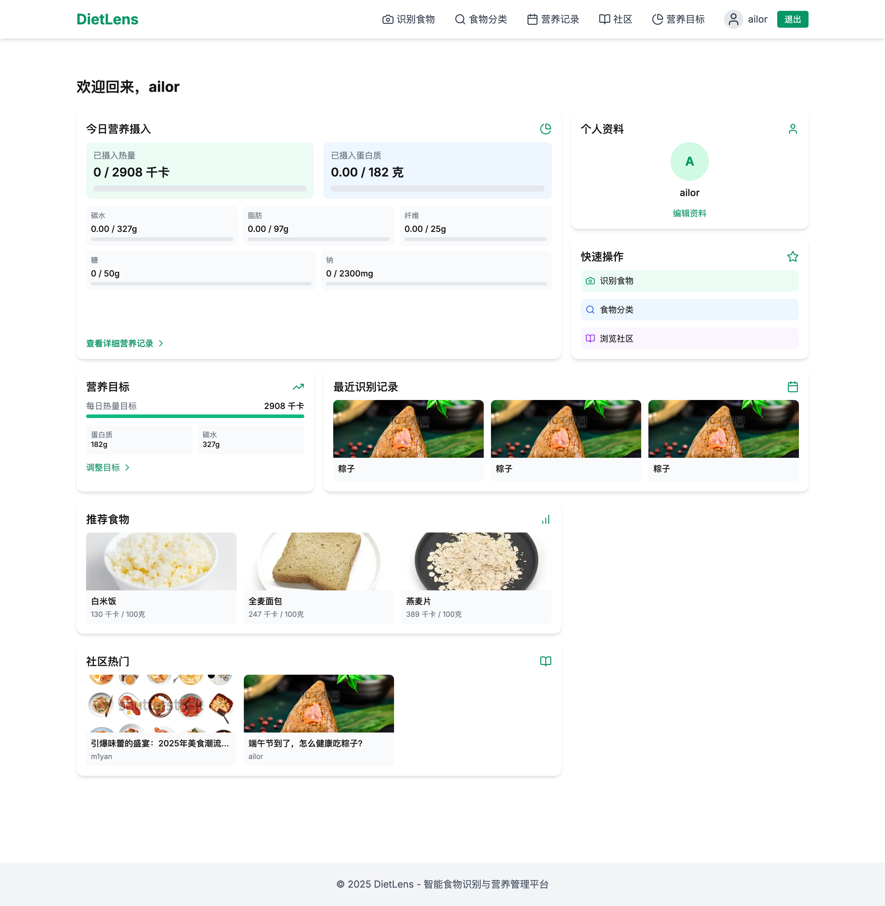
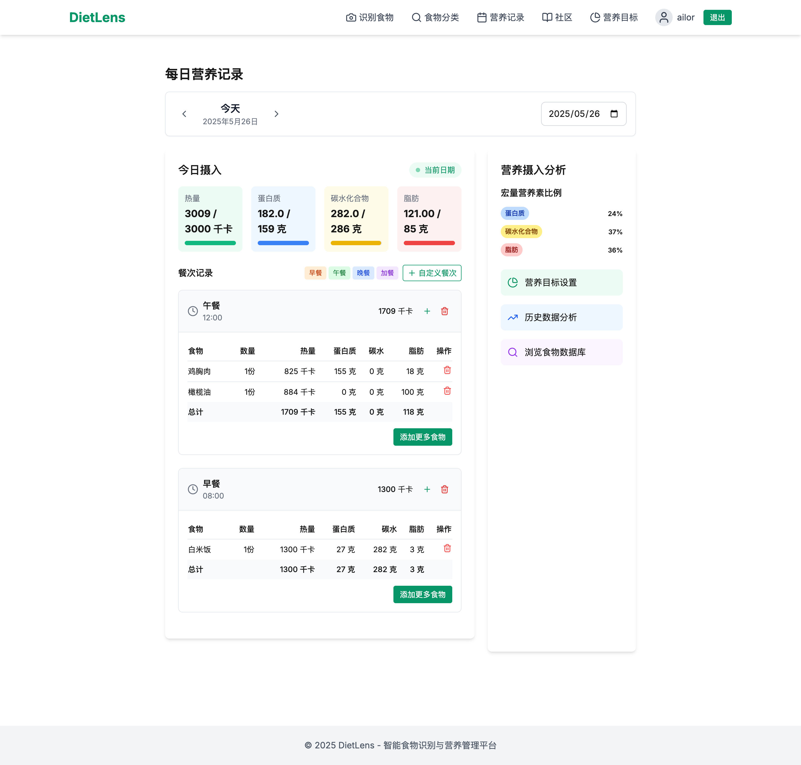
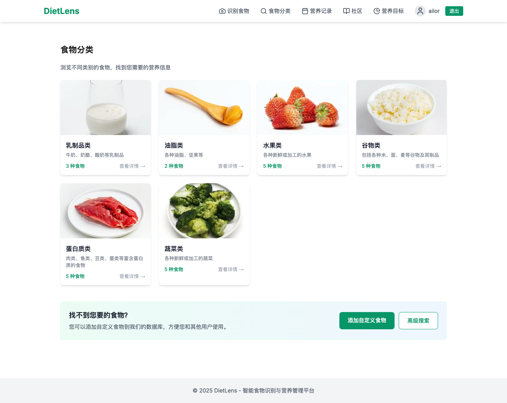

# DietLens - 智能食物识别与营养管理平台

## 项目概述

DietLens是一个智能饮食管理应用，主要功能包括：
- **智能食物识别**：上传食物图片，使用OpenAI多模态API分析图片中食物的营养和能量
- **DietLens社区**：用户和营养专家能够在社区中发表图文帖子
- **手动搜索食物**：通过食物名称查询食物的营养成分和能量等信息
- **查看今日营养目标**：为用户维护营养数据库，将每日摄入情况展示出来





## 技术栈

### 后端
- Python 3.8+
- Flask 2.0+
- MySQL 5.7+
- OpenAI API (GPT-4 Vision)

### 前端
- Next.js 15.1.8
- React 19.0.0
- TypeScript
- Tailwind CSS

## 快速开始

### 系统要求
- 操作系统：Linux, macOS 或 Windows
- Node.js: v16.0.0 或更高版本
- Python: 3.8 或更高版本
- MySQL: 5.7 或更高版本

### 使用脚本快速启动

1. **数据库初始化**：运行 [`setup_db.sh`](setup_db.sh ) 脚本创建必要的数据库和用户
   ```bash
   ./setup_db.sh
   ```

2. **开发环境启动**：运行 [`start.sh`](start.sh ) 脚本同时启动前端和后端服务
   ```bash
   ./start.sh
   ```

3. **生产环境部署**：运行 [`deploy.sh`](deploy.sh ) 脚本构建前端并将其集成到后端
   ```bash
   ./deploy.sh
   ```

### 手动部署步骤

#### 1. 数据库配置

```bash
# 创建数据库
mysql -u root -p
CREATE DATABASE dietlens;
CREATE USER 'dietlens'@'localhost' IDENTIFIED BY 'dietlens';
GRANT ALL PRIVILEGES ON dietlens.* TO 'dietlens'@'localhost';
FLUSH PRIVILEGES;
EXIT;
```

#### 2. 后端配置

```bash
# 进入后端目录
cd dietlens-backend

# 创建并激活虚拟环境
conda create -n dietlens python=3.10.0

# 安装依赖
pip install -r requirements.txt

# 初始化数据库
python init_db.py

# 开发模式启动
python src/main.py
```

开发模式下，后端API将在 http://localhost:5000 上运行。

#### 3. 前端配置

```bash
# 进入前端目录
cd dietlens-frontend

# 安装依赖
npm install

# 开发模式启动
npm run dev

# 或构建生产版本
npm run build
```

开发模式下，前端服务将在 http://localhost:3000 上运行。

## 项目结构

```
dietlens/
├── dietlens-backend/           # 后端代码
│   ├── src/                    # 源代码目录
│   │   ├── config/             # 配置文件
│   │   ├── models/             # 数据库模型
│   │   ├── routes/             # API路由
│   │   ├── static/             # 静态文件
│   │   ├── utils/              # 工具类
│   │   └── main.py             # 应用入口
│   ├── init_db.py              # 数据库初始化脚本
│   └── requirements.txt        # 项目依赖
│
├── dietlens-frontend/          # 前端代码
│   ├── src/
│   │   ├── app/                # 应用页面
│   │   ├── components/         # 可复用组件
│   │   └── lib/                # 工具库
│   └── package.json            # 项目依赖
│
├── deploy.sh                   # 部署脚本
├── setup_db.sh                 # 数据库设置脚本
└── start.sh                    # 开发环境启动脚本
```

## 文档

- 前端文档
- 后端文档
- 部署指南

## API接口

详细的API文档请参考后端API接口文档，主要包括：

- 用户认证
- 食物识别
- 社区功能
- 食物搜索
- 营养目标管理

## 常见问题

### 1. 数据库连接失败

检查 `.env` 文件中的数据库连接信息是否正确，并确保MySQL服务已启动。

### 2. 前端无法连接后端API

确保CORS配置正确，并检查 `.env.local` 文件中的 `NEXT_PUBLIC_API_BASE_URL` 设置。

### 3. CORS跨域问题

使用Request插件解决跨域问题。